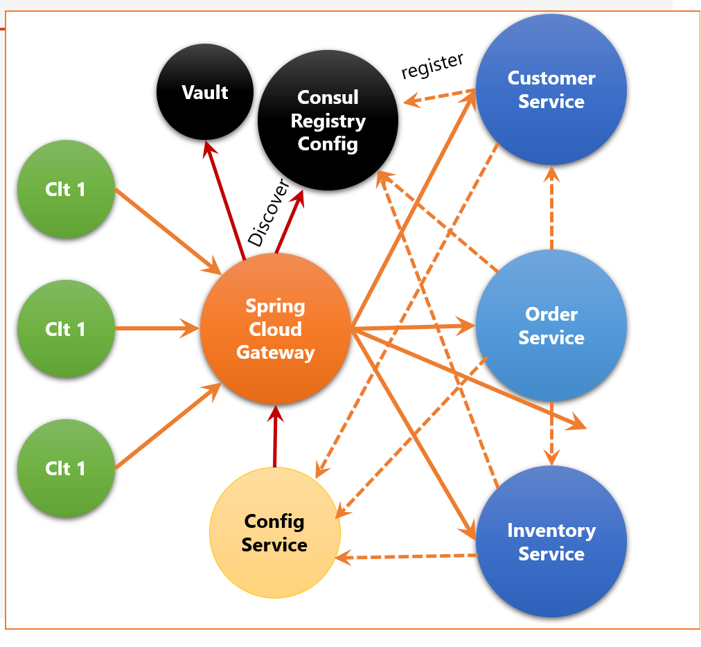
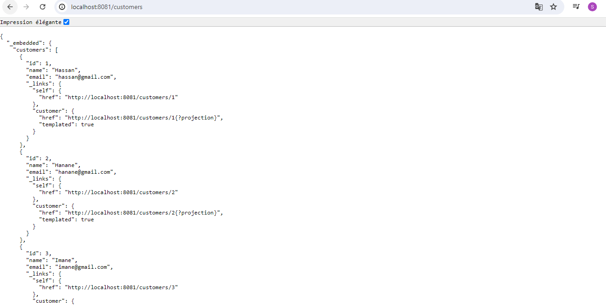
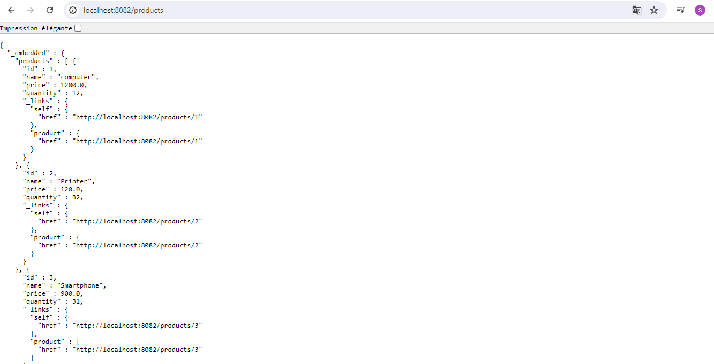
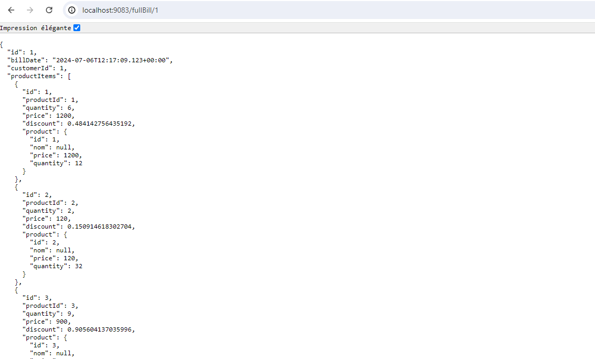

<h3>Microservices Web App </h3>
<p>
Bienvenue dans notre application basée sur une architecture micro-service qui permet de gérer les factures contenant des produits et appartenant à un client.
Cette application tire parti des technologies modernes telles que Consul Discovery, Spring Cloud Config, Spring Cloud Gateway, Angular,
et bien d'autres pour offrir une expérience utilisateur optimale et une gestion efficace des ressources.
</p>
<h3>Architecture Application </h3>


[📌 Explorer le CUSTOMER-SERVICE](#customer-service) : 

   Gérez les informations des clients.

## Données de test

```java
@Bean
CommandLineRunner start(CustomerRepository customerRepository){
    return args -> {
        customerRepository.saveAll(List.of(
            Customer.builder().name("Mohamed").email("med@gmail.com").build(),
            Customer.builder().name("Hassan").email("hasan@gmail.com").build(),
            Customer.builder().name("Imane").email("imane@gmail.com").build()
        ));
        customerRepository.findAll().forEach(System.out::println);
    };
}
```
## Customer service Test


[📌 Explorer le INVENTORY-SERVICE](#inventory-service) : 

## inventory service Test


[📌 Explorer le Billing-SERVICE](Billing-service) :

## inventory service Test


[📌 Eureka Discovery Server ](Eureka-discovery) :

## Eureka discovery server


